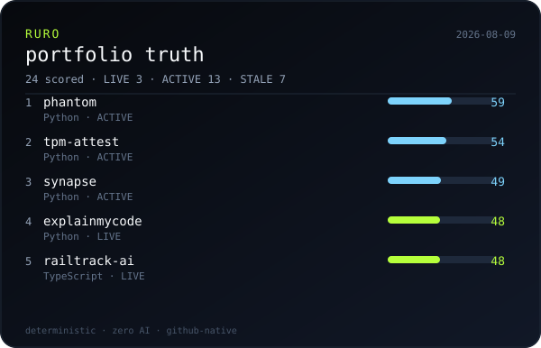

# Overview

GitHub OS for `grsanudeep42-cmd` — automatic truth, verified deploys, optional Copilot judgment.

<div align="center">

<a href="https://grsanudeep42-cmd.github.io/ruro/"></a>

</div>

```text
$ ruro view
  24 fleet · 4 verified live · 2026-08-09 15:19 UTC
```

| Project | Status | Score | Stack | Deploy |
|---|---|---:|---|---|
| **[aryanbloodbank](https://github.com/grsanudeep42-cmd/aryanbloodbank)** | `LIVE` | **63** | TypeScript | verified |
| **[phantom](https://github.com/grsanudeep42-cmd/phantom)** | `ACTIVE` | **59** | Python | none |
| **[tpm-attest](https://github.com/grsanudeep42-cmd/tpm-attest)** | `ACTIVE` | **54** | Python | none |
| **[synapse](https://github.com/grsanudeep42-cmd/synapse)** | `ACTIVE` | **49** | Python | none |
| **[explainmycode](https://github.com/grsanudeep42-cmd/explainmycode)** | `LIVE` | **48** | Python | verified |

**Surfaces**

| File | Role |
| --- | --- |
| [README.md](./README.md) | Product + CLI |
| [OVERVIEW.md](./OVERVIEW.md) | This living fleet snapshot |
| [LICENSE](./LICENSE) | MIT |
| [docs/](./docs/) | Pages OS |
| [DASHBOARD.md](./DASHBOARD.md) | Full markdown scorecard |

<sub>Generated 2026-08-09T15:19:27.889Z · [Open OS](https://grsanudeep42-cmd.github.io/ruro/)</sub>
